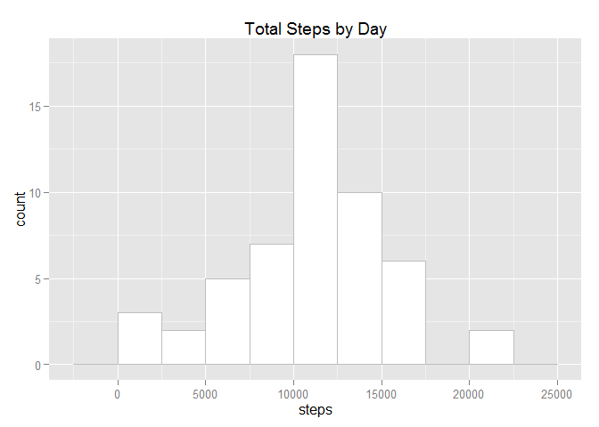
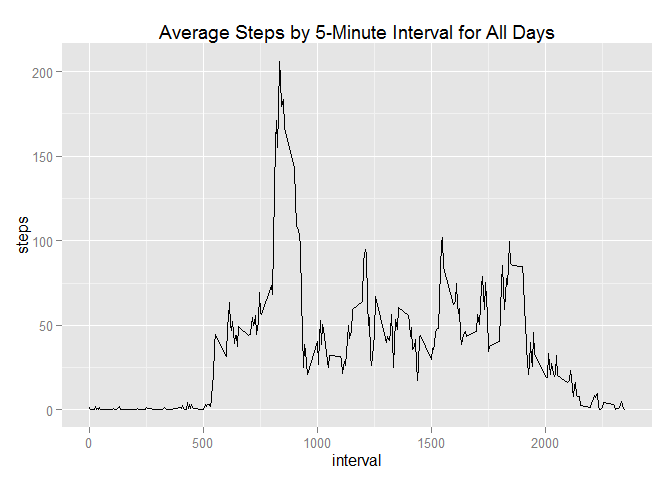
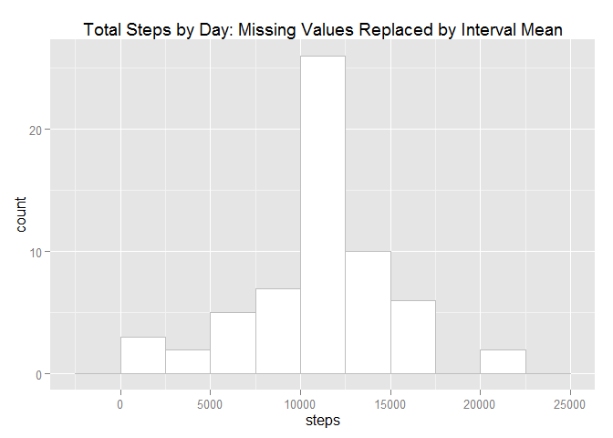
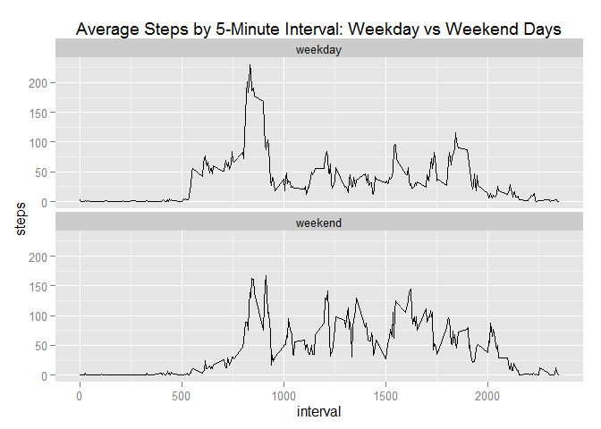

# Reproducible Research: Peer Assessment 1


## Loading and preprocessing the data

Load the data (i.e. read.csv())

Process/transform the data (if necessary) into a format suitable for your analysis


```r
library(ggplot2)
setwd("C:/Users/kelly.blachford/datasciencecoursera/RepData_PeerAssessment1")
unzip("activity.zip")
a <- read.csv("activity.csv")
a$date <- as.Date(a$date)
```


## What is mean total number of steps taken per day?

For this part of the assignment, you can ignore the missing values in the dataset.


```r
ac <- na.omit(a)
```

Calculate the total number of steps taken per day

```r
sbd <- aggregate(steps ~ date, data=ac, FUN=sum)
```

Make a histogram of the total number of steps taken each day

```r
sbdh <- ggplot(sbd, aes(x=steps)) +
    geom_histogram(binwidth=2500, colour="grey", fill="white")
sbdh + ggtitle("Total Steps by Day")
```

 


Calculate and report the mean and median of the total number of steps taken per day

```r
mean(sbd$steps)
```

```
## [1] 10766.19
```

```r
median(sbd$steps)
```

```
## [1] 10765
```


## What is the average daily activity pattern?

Make a time series plot (i.e. type = "l") of the 5-minute interval (x-axis) and the average number of steps taken, averaged across all days (y-axis)


```r
sbi <- aggregate(steps ~ interval, data=ac,
                               FUN=mean)
sbil <- ggplot(sbi, aes(x=interval, y=steps)) +
  geom_line(stat="identity")
sbil + ggtitle("Average Steps by 5-Minute Interval for All Days")
```

 

Which 5-minute interval, on average across all the days in the dataset, contains the maximum number of steps?


```r
sbi$interval[which.max(sbi$steps)]
```

```
## [1] 835
```


## Imputing missing values

Note that there are a number of days/intervals where there are missing values (coded as NA). The presence of missing days may introduce bias into some calculations or summaries of the data.

Calculate and report the total number of missing values in the dataset (i.e. the total number of rows with NAs)


```r
length(which(is.na(a)))
```

```
## [1] 2304
```

Devise a strategy for filling in all of the missing values in the dataset. The strategy does not need to be sophisticated. For example, you could use the mean/median for that day, or the mean for that 5-minute interval, etc.


###Strategy used below replaces the missing step values with the mean for the 5-minute interval. 

Create a new dataset that is equal to the original dataset but with the missing data replaced by the mean value for the interval.


```r
sv <- data.frame(a$steps)
sv[is.na(sv),] <- ceiling(tapply(X=a$steps,INDEX=a$interval,FUN=mean,na.rm=TRUE))
anew <- cbind(sv, a[,2:3])
colnames(anew) <- c("steps", "date", "interval")
```


Make a histogram of the total number of steps taken each day with missing values replaced by the mean for the interval.


```r
sbdnew <- aggregate(steps ~ date, data=anew, FUN=sum)

sbdhnew <- ggplot(sbdnew, aes(x=steps)) +
    geom_histogram(binwidth=2500, colour="grey", fill="white")
sbdhnew + ggtitle("Total Steps by Day: Missing Values Replaced by Interval Mean")
```

 


Calculate and report the mean and median of the total number of steps taken per day with missing values replaced by interval mean


```r
mean(sbdnew$steps)
```

```
## [1] 10784.92
```

```r
median(sbdnew$steps)
```

```
## [1] 10909
```

Do these values differ from the estimates from the first part of the assignment?


```r
mean(sbdnew$steps)-mean(sbd$steps)
```

```
## [1] 18.72935
```

```r
median(sbdnew$steps)-median(sbd$steps)
```

```
## [1] 144
```

What is the impact of imputing missing data on the estimates of the total daily number of steps?

Imputing missing values by replacing them with the mean interval value increased the average number of daily steps by 18.73 steps.


```r
mean(sbdnew$steps)-mean(sbd$steps)
```

```
## [1] 18.72935
```


## Are there differences in activity patterns between weekdays and weekends?

For this part the weekdays() function may be of some help here. Use the dataset with the filled-in missing values for this part.

Create a new factor variable in the dataset with two levels - "weekday" and "weekend" indicating whether a given date is a weekday or weekend day.


```r
anew$day[weekdays(as.Date(anew$date)) %in% c("Saturday", "Sunday")] <- "weekend"
anew$day[!weekdays(as.Date(anew$date)) %in% c("Saturday", "Sunday")] <- "weekday"
anew[, 4] <- as.factor(anew[, 4])
```

Make a panel plot containing a time series plot (i.e. type = "l") of the 5-minute interval (x-axis) and the average number of steps taken, averaged across all weekday days or weekend days (y-axis).


```r
sbinew <- aggregate(steps ~ interval + day, data=anew, FUN=mean)
sbinewl <- ggplot(sbinew, aes(x=interval, y=steps, group=1)) + geom_line() +
    facet_wrap(~ day, ncol=1)
sbinewl + ggtitle("Average Steps by 5-Minute Interval: Weekday vs Weekend Days")
```

 


